## Proyecto de Clase: Sistema de Bienes Raices 240162
---

En este proyecto se prondan en ejemplo practico la creacion de API's propias asi como el consumo de APIs de Terceros Gestion de Mapas, Envio de Correos, Autentificacion por Redes Sociales, Gestion de Bases de Datos, Gestion de Archivos, Seguridad, Control de Sesiones y validaciones. En el contexto real de la compra, venta o renta de propiedades.

---
#### Consideraciones:

El proyecto estara basado en una Arquitectura SOA (Service Oriented Architecture), el Patron de Diseño MVC (Model, View, Controler) y servicios API REST, debera gestionarse debidamente en el uso del contro de versiones y ramas progresivas del desarrollo del mismo.

### Tabla de Secciones

|No.|Descripcion|Potenciador|Estatus|
|---|---|---|---|
|1.| Configuracion inicial del Proyecto (NodeJS) | 2 | ✅ Finalizado |
|2.| Routing y Requests (Peticiones) | 5 | ✅ Finalizado |
|3.| Layouts, Template Engines y Tailwind CSS (Frontend)| 5 | ✅ Finalizado |
|4.| Creacion de paginas de Login y Creacion de Usuarios| 6 | ✅ Finalizado |
|5.| ORM's y Bases de Datos | 7 | ✅ Finalizado |
|6.| Insertando Registros en la Tabla Usuarios| 20 | ✅ Finalizado |
|7.| Implementacion de la Fucnionalidad (Feature) Recuperacion de Contraseña (Password Recovery)|15|✅ Finalizado|
|8.| Autentificacion de Usuarios (auth)| 20 | ✅ Finalizado |
|9.| Definicion de Clase Propiedades (property)| --- | --- |
|10.| Operaciones CRUD (Create, Read, Update, Delete) de las Propuedades | --- | --- |
|11.| Protecion de Rutas y Validacion de Tokes de Sesion (JWT) | --- | --- |
|12.| Añadir Imagenes a la Propiedad (Gestion de Archivos) | --- | --- |
|13.| Elaboracion Panel de Administracion (Dashboard)| --- | --- |
|14.| Formulario de Edicion de Propiedades | --- | --- |
|15.| Formulario de Eliminacion de Propiedades | --- | --- |
|16.| Pagina de Consulta de la Propiedad | --- | --- |
|17.| Implementacion del Paginador | --- | --- |
|18.| Creando la Pagina Inicial (index)| --- | --- |
|19.| Creando las Paginas de Categorias y Paginas de Error (404) | --- | --- |
|20.| Envio de Email por un formulario de Contacto | --- | --- |
|21.| Cambiar el Estatus de una Propiedad | --- | --- |
|22.| Barras de Navegacion y Cierre de Sesion | --- | --- |
|23.| Publicacion del API y el Frontend | --- | --- |

## Resultados Obtenidos

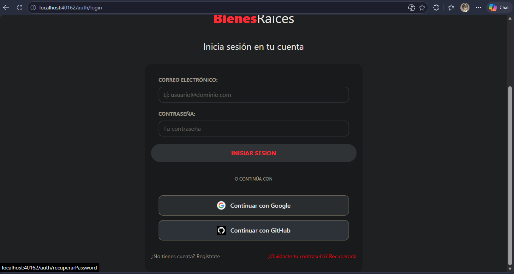
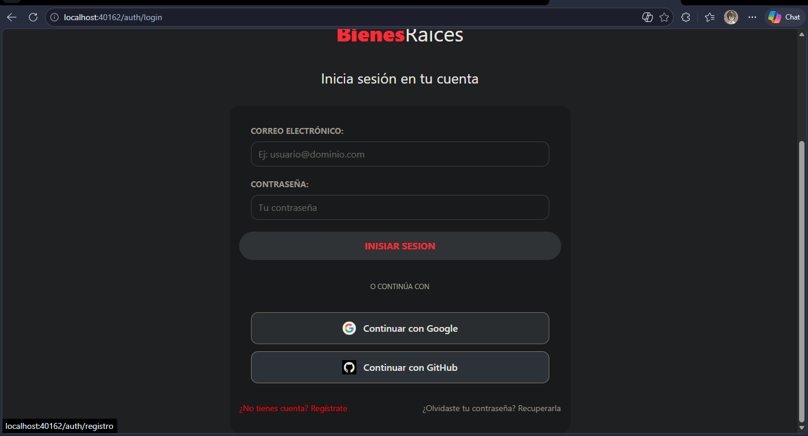
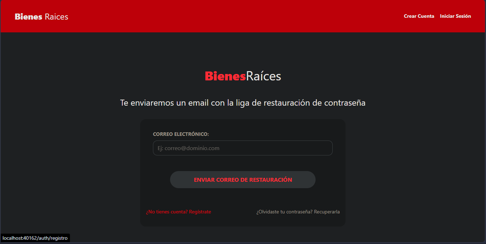
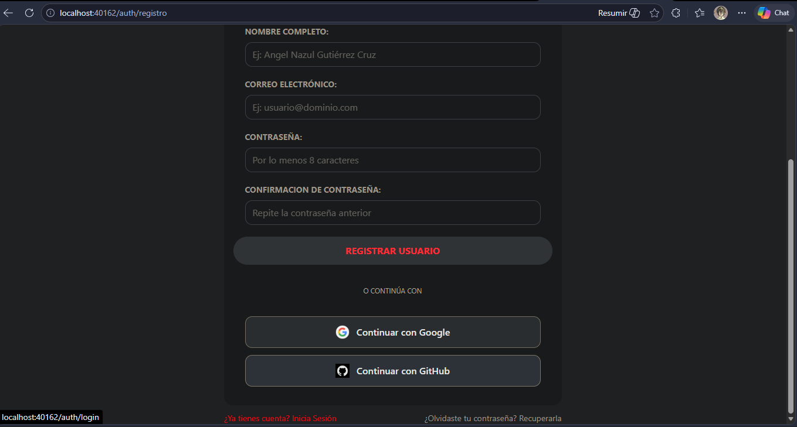
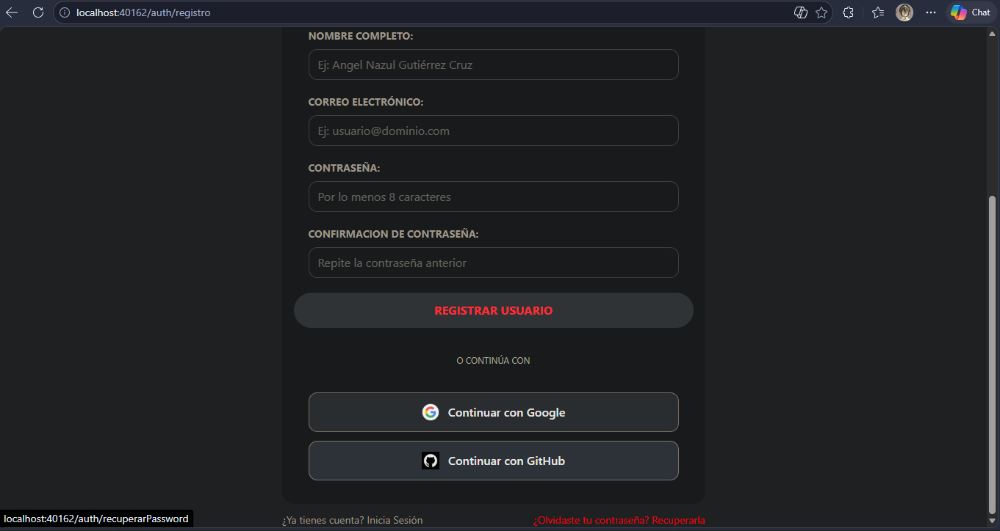

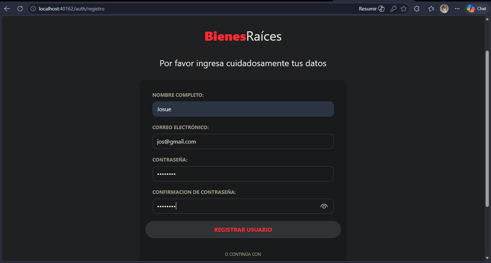
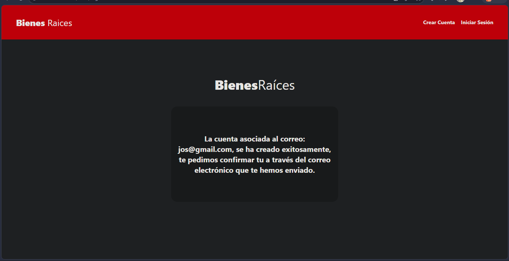
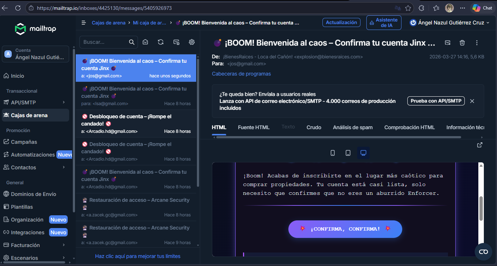
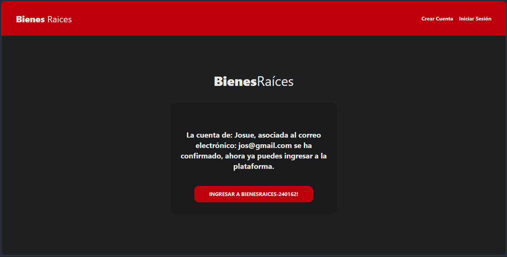

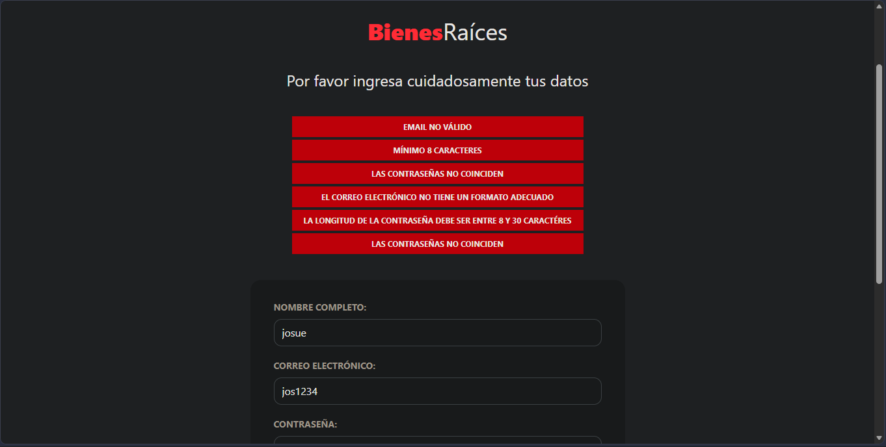

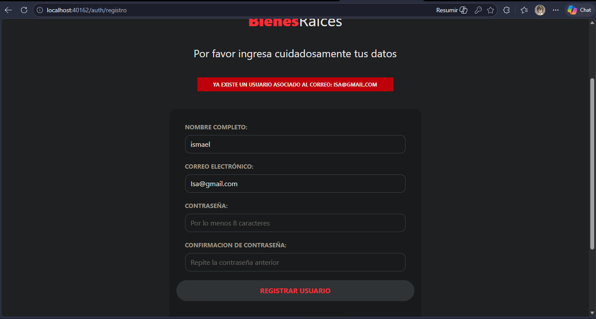

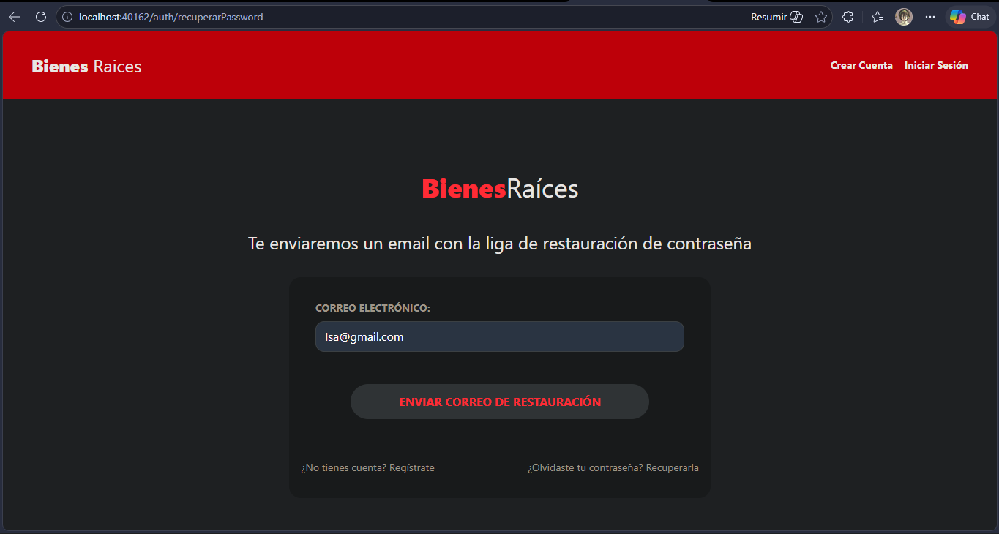

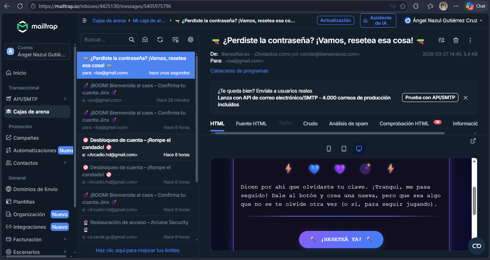
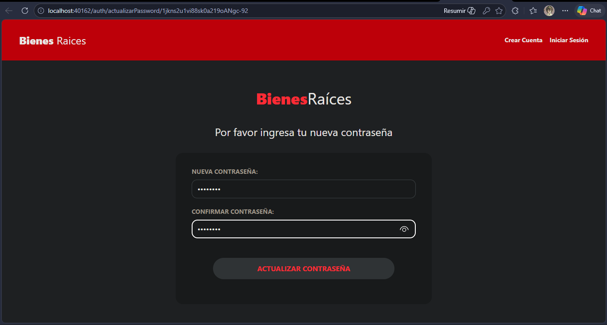
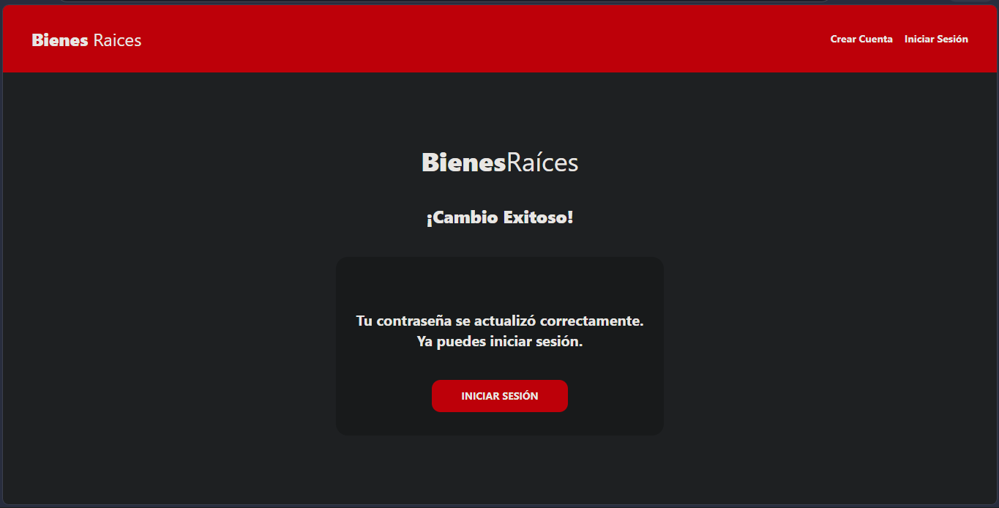

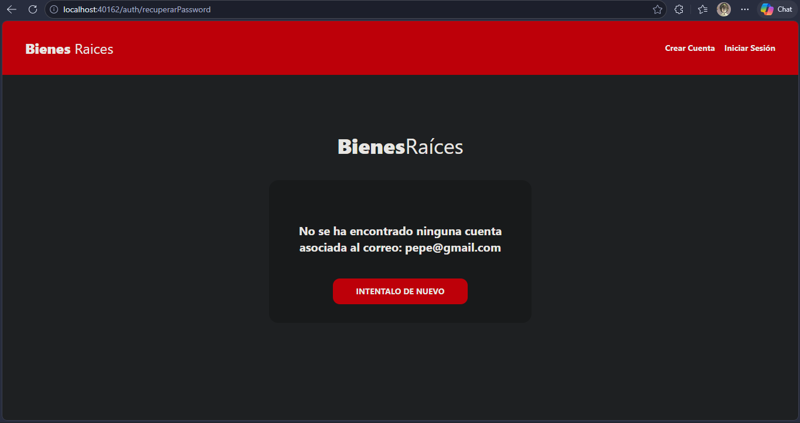

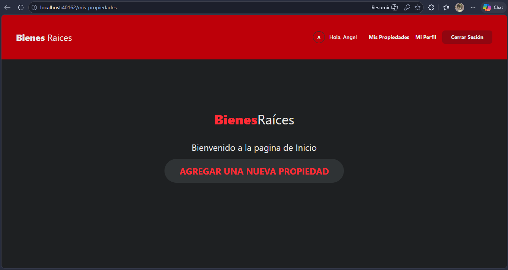

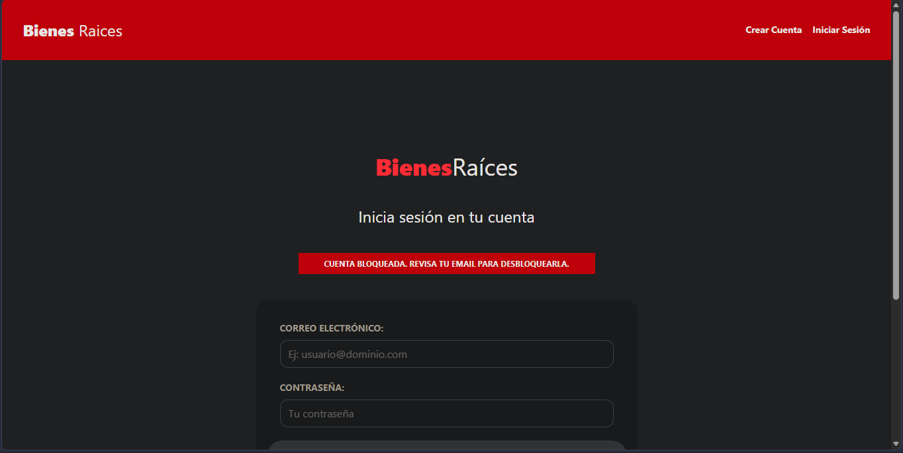
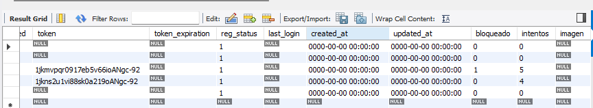

### Creado por: 
Angel Nazul Gutierrez Cruz - 240162.
    